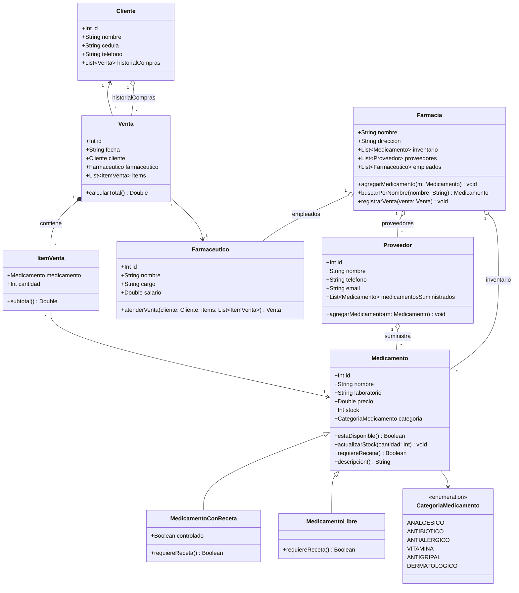

# Modelo de Clases — Caso de Estudio: Farmacia

## Descripción de las clases

- **Medicamento**: clase base con los datos comunes de todo producto farmacéutico (nombre, laboratorio, precio, stock, categoría). Es abierta (`open`) para permitir especializarse.
- **MedicamentoConReceta** / **MedicamentoLibre**: subclases que redefinen `requiereReceta()` según si el medicamento necesita prescripción médica o se vende libremente.
- **CategoriaMedicamento**: enumeración con las categorías de medicamentos que maneja la farmacia.
- **Proveedor**: empresa que suministra medicamentos a la farmacia.
- **Cliente**: persona que compra medicamentos; mantiene su historial de compras.
- **Farmaceutico**: empleado que atiende las ventas.
- **ItemVenta**: línea de una venta (un medicamento + cantidad comprada).
- **Venta**: transacción compuesta por uno o más `ItemVenta`, asociada a un cliente y al farmacéutico que la atendió.
- **Farmacia**: clase principal que agrupa el inventario, los proveedores y los empleados, y coordina las operaciones (agregar medicamentos, registrar ventas, buscar productos).

Este modelo se implementa exactamente en Kotlin dentro de `app/src/main/java/com/example/parcial1/model/`.
